# Tizen Homebrew

Install apps on a Samsung TV from your phone.


Developer Mode normally points a TV at a computer that has to stay on the
network. This points it at `127.0.0.1` — the TV becomes its own developer
machine — and puts the interface on your phone. Set it up once; no computer
after that.

- Install from a catalog, a GitHub release, a URL, or a USB stick
- Re-signs every package for your TV, so builds signed by other people install
- A dmesg-style log on the TV screen
- An sdb shell, from the phone

**Discord**: https://discord.gg/WjxVnrsV4A

---

## Install

**Node 20+**, a Samsung TV on the same network, ten minutes. Use your TV's
address in place of `192.168.2.9`.

**1 · On the TV.** **Apps** → press **12345** (or hold Enter) → Developer mode
**on**, **Host PC IP** = *this computer's address*. **Restart the TV.**

**2 · On your computer.**

```sh
git clone https://github.com/SushyDev/tizen-homebrew.git
cd tizen-homebrew
npm install
npm run full-bootstrap -- 192.168.2.9
```

It asks the TV which device it is, mints a Samsung certificate bound to it (a
browser opens — sign in), then builds, signs, installs and opens the app. No
Tizen Studio needed. The certificate is yours — your own Samsung account,
public level, nothing shared — and lands in `~/.tizen-certs`.

It also leaves the certificates on the TV, so from the first boot it re-signs
whatever it installs — including packages built by other people.

**3 · On the TV again.** **Apps** → **12345** → **Settings**, **Host PC IP** =
`127.0.0.1`. **Restart the TV.**

This is the step that makes the rest work, and no software can do it for you —
sdbd runs a command allowlist. From here the TV installs its own apps and no
other machine can reach its sdb daemon.

---

## Screens

<table>
<tr>
https://raw.githubusercontent.com/SushyDev/tizen-homebrew/refs/heads/update-docs/media/tv.mp4
https://user-images.githubusercontent.com/23558090/115278602-ee6f0280-a145-11eb-94ae-6edaa846ab7f.mp4
<td width="75%" valign="top"><a href="media/tv.mp4">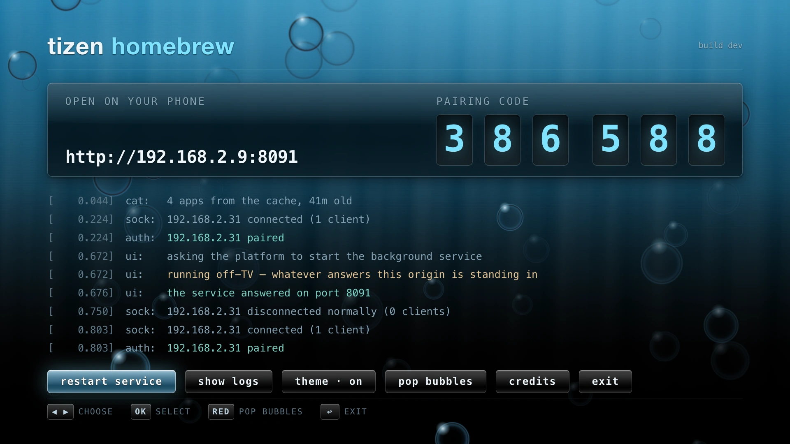</a></td>
<td width="25%" valign="top"><a href="media/phone.mp4">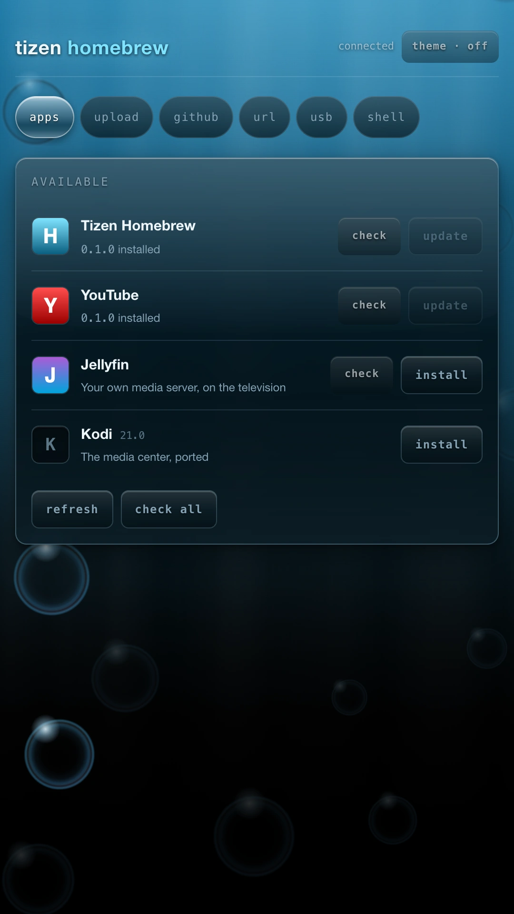</a></td>
</tr>
<tr>
<td align="center"><sub><b><a href="media/tv.mp4">▶ The television</a></b> — 37s · pairing, an install as it lands, the log console, the credits</sub></td>
<td align="center"><sub><b><a href="media/phone.mp4">▶ The phone</a></b> — 33s</sub></td>
</tr>
</table>

### On the TV

<table>
<tr>
<td></td>
</tr>
<tr>
<td align="center"><sub>The address, the code, and whatever the service is doing</sub></td>
</tr>
</table>

<table>
<tr>
<td width="33%">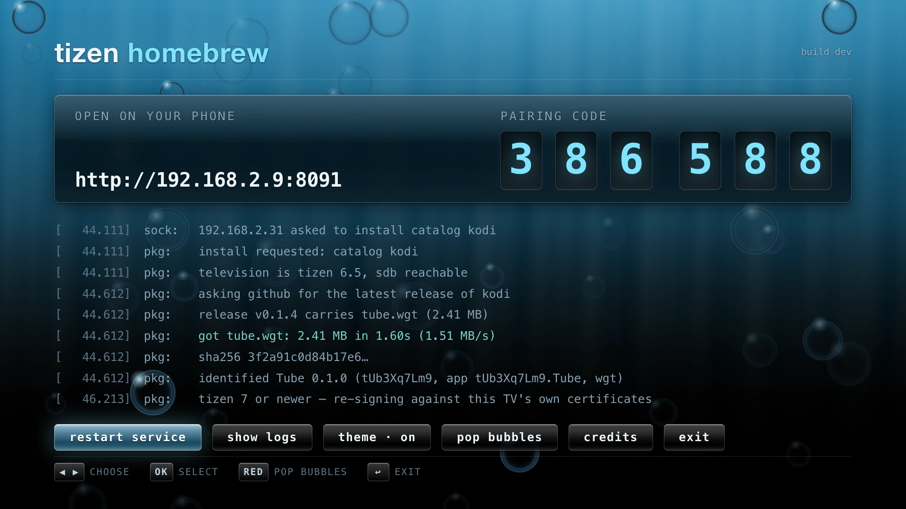</td>
<td width="33%">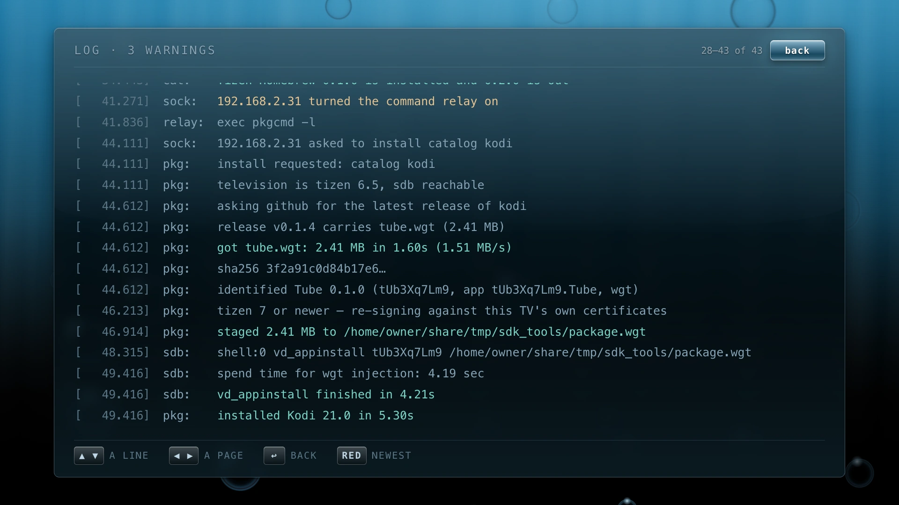</td>
<td width="33%">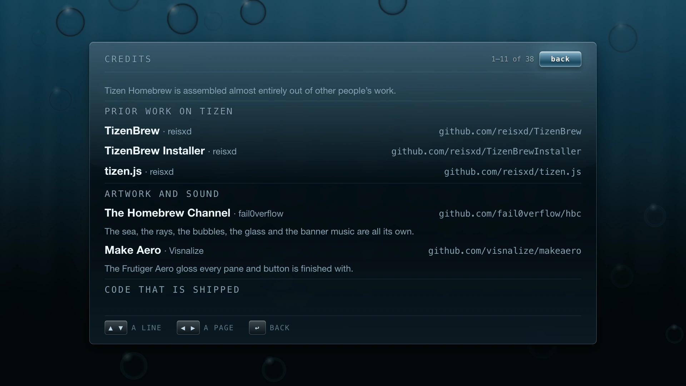</td>
</tr>
<tr>
<td align="center"><sub>An install, as it happens</sub></td>
<td align="center"><sub>The log console</sub></td>
<td align="center"><sub>Credits</sub></td>
</tr>
</table>

### On the phone

<table>
<tr>
<td width="33%">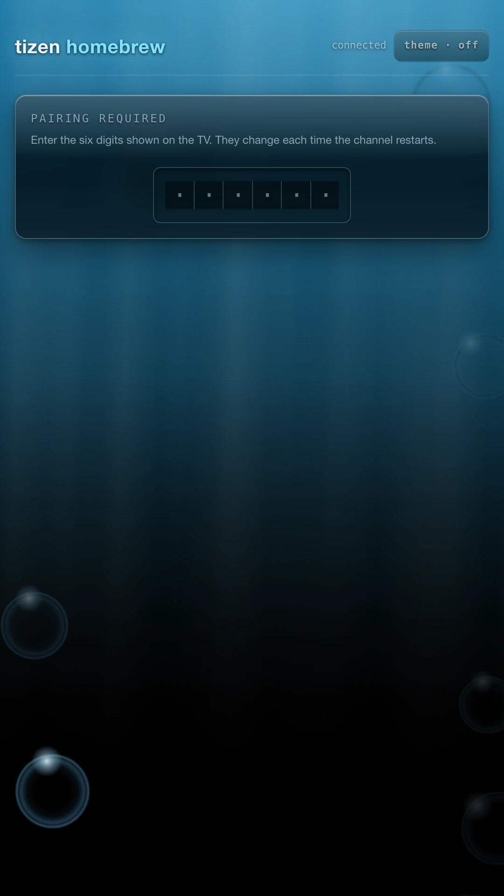</td>
<td width="33%"></td>
<td width="33%">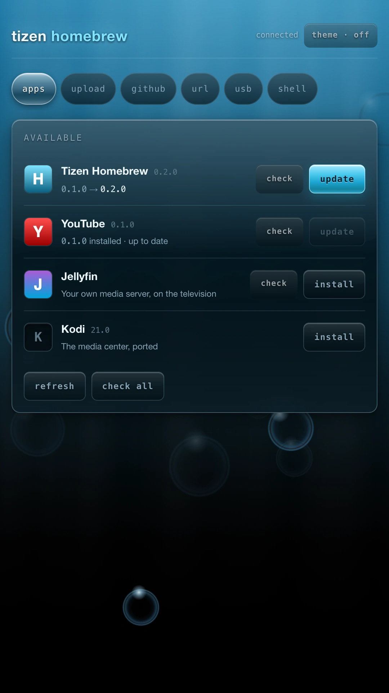</td>
</tr>
<tr>
<td align="center"><sub><b>Pairing</b> — the six digits on the TV</sub></td>
<td align="center"><sub><b>Apps</b> — the catalog, and what is already on the TV</sub></td>
<td align="center"><sub><b>check all</b> — what has a newer release</sub></td>
</tr>
<tr>
<td>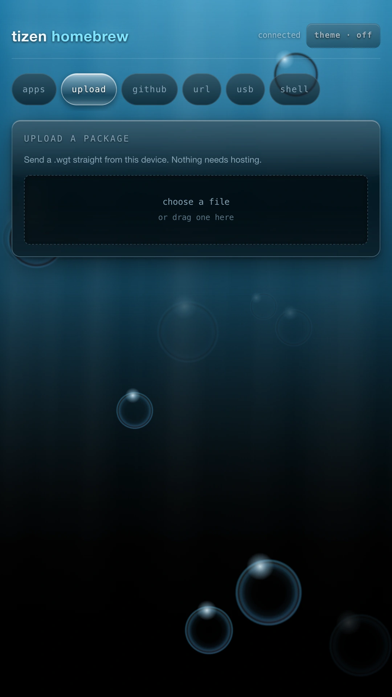</td>
<td>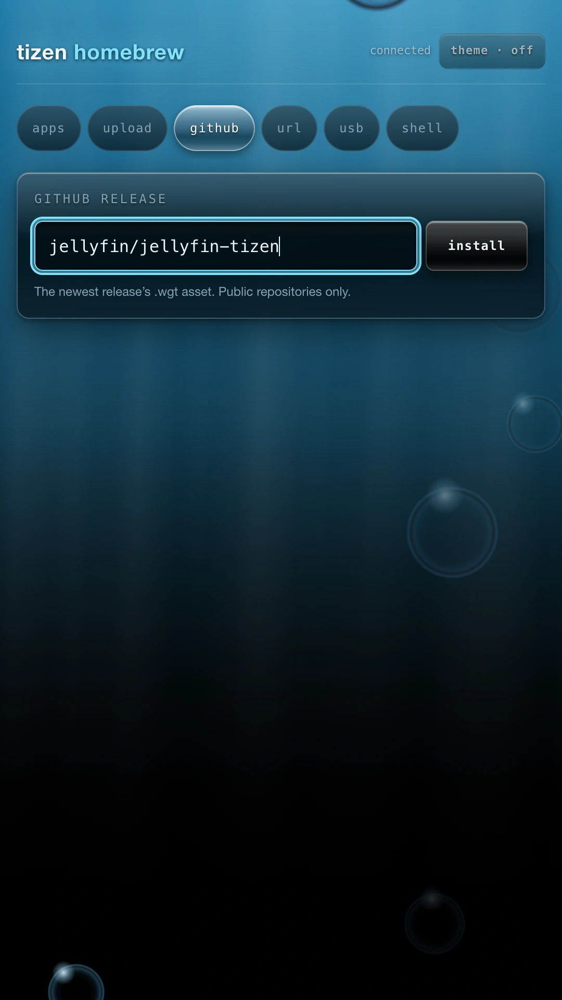</td>
<td>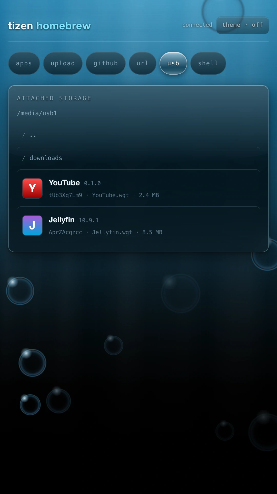</td>
</tr>
<tr>
<td align="center"><sub><b>Upload</b> — a .wgt from the phone</sub></td>
<td align="center"><sub><b>GitHub</b> — owner/repo, newest release</sub></td>
<td align="center"><sub><b>USB</b> — a stick plugged into the TV</sub></td>
</tr>
<tr>
<td>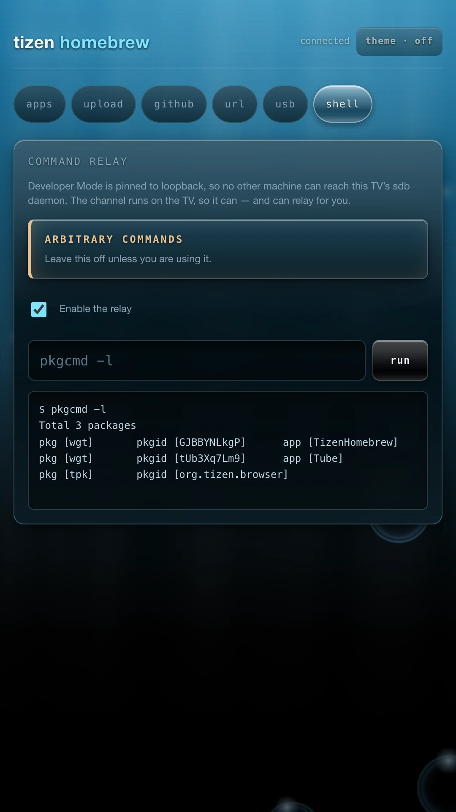</td>
<td>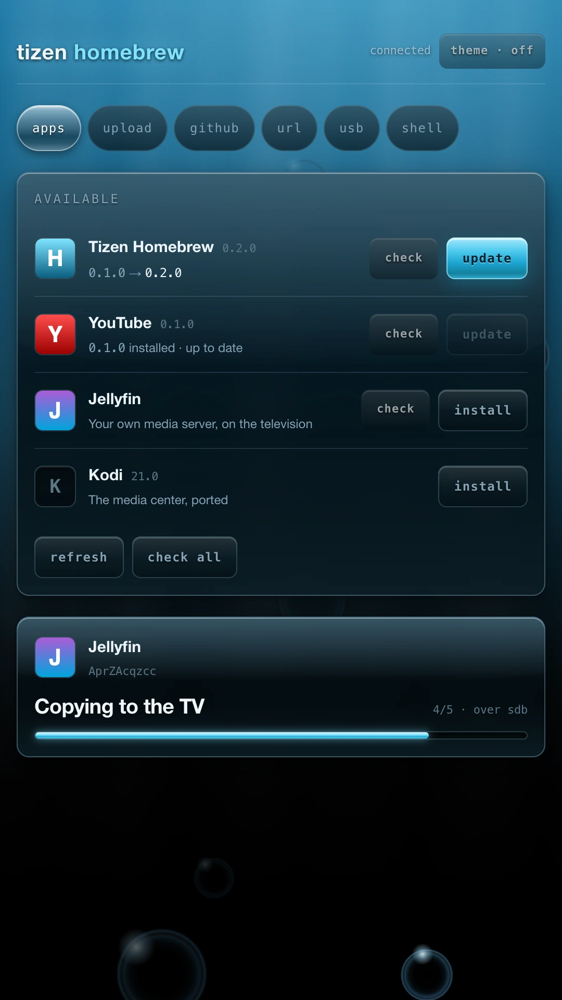</td>
<td>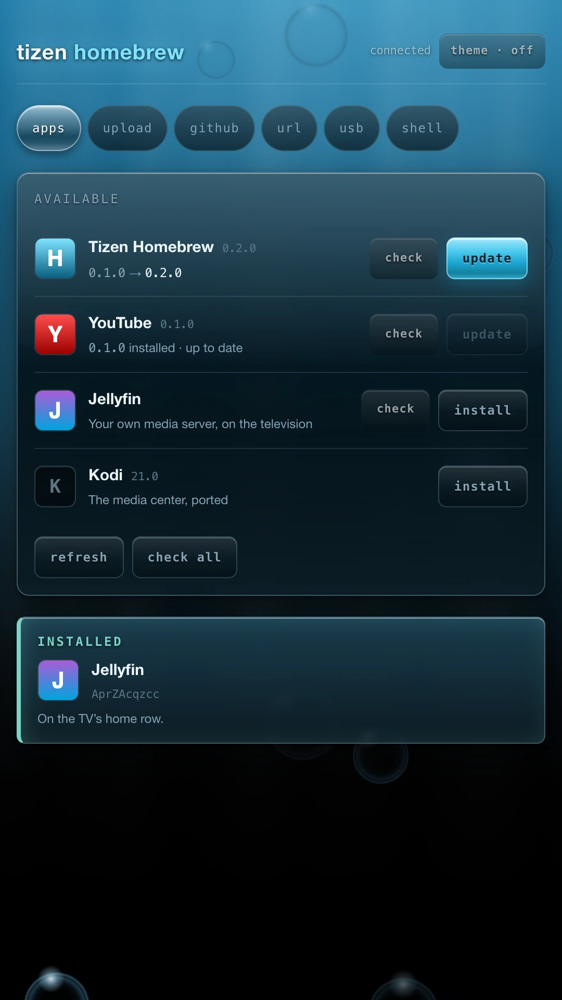</td>
</tr>
<tr>
<td align="center"><sub><b>Shell</b> — sdb commands, off by default</sub></td>
<td align="center"><sub>Five steps, re-signing among them</sub></td>
<td align="center"><sub>On the TV's home row</sub></td>
</tr>
</table>

---

## Using it

| Tab | |
| --- | --- |
| **Apps** | The catalog, installed with one press |
| **Upload** | A `.wgt` from the phone |
| **GitHub** | `owner/repo` — takes the newest release |
| **URL** | A direct https link |
| **USB** | A stick plugged into the TV |
| **Shell** | sdb commands, off by default |

The PIN changes every time the app is opened; the TV screen shows the current
one. Your phone keeps the last one that worked, so reloading the page does not
ask for it again — until the TV restarts and mints a new one.

**Updates.** The **Apps** tab knows what is already on the TV — every row
that is installed says so, and at which version. Whether anything newer has
been *released* is a request to GitHub per app, so it waits to be asked:
**check** on one row, or **check all** under the list. An app with a newer
release then says *update* instead of *install*, with the version it would
replace underneath.

Tizen Homebrew is in its own catalog, so that is also how the channel
updates itself. Pressing it is an ordinary install of an ordinary package that
happens to be this one. From a working copy, over the LAN, there is still:

```sh
npm run package && npm run push -- 192.168.2.9 <pin>
```

---

## Commands

| | |
| --- | --- |
| `npm run full-bootstrap -- <ip>` | Certificate, build, install — the whole setup |
| `npm run mint -- <ip> [pin]` | Certificate only; adds this TV to the pair you have |
| `npm run package` | Build a `.wgt` signed by nobody — what a release carries |
| `npm run package -- --sign` | The same, signed for this machine's TV — what sdb needs |
| `npm run bootstrap -- <ip>` | Install over sdb (needs Host PC IP pointed here) |
| `npm run push -- <ip> <pin>` | Install over the LAN, once the app is running |
| `npm run certs -- <ip> <pin>` | Re-send the TV's certificates; bootstrap already did (`--forget` removes) |
| `npm run duid -- <ip> [pin]` | Print the device id a certificate binds to |
| `npm run repl -- <ip>` | A prompt inside the running service — developer builds only |
| `npm run doctor` | Check prerequisites when something looks wrong |

Given the PIN, `mint` `certs` `duid` `push` all work with the TV pinned to
`127.0.0.1`. `bootstrap` cannot — it needs sdbd, which is what a pinned set
stops answering.

**Developer builds.** `--dev` fixes the pairing PIN at `000000` and puts a
prompt inside the service, so a build being pushed every few minutes stops
asking to have its PIN read off the screen:

```sh
npm run package -- --dev && npm run push -- 192.168.2.9 000000
npm run repl -- 192.168.2.9
```

Every line is evaluated in the running service — `store.get()`, `await
packages.list()`, `require('fs').readdirSync('/opt/usr/apps').length` — and
`.inspect` opens Node's own inspector on the set for Chrome DevTools,
breakpoints and heap snapshots. `.names` lists what is in scope.

This is arbitrary code execution as the service, reachable by anything on the
network, so it exists only in a build made this way: an ordinary build has no
`/dev` routes in it at all, because the bundler drops the branch. `npm run
package -- --release` refuses a developer build outright.

**When it goes wrong**

| The message | What to do |
| --- | --- |
| `Check certificate error … Invalid signature` | Your pair does not cover this TV — `npm run mint -- <ip>` |
| `Author certificate not match` | The author certificate changed — `npm run bootstrap -- <ip> --replace` |
| `accepted the connection then dropped it` | Host PC IP is not this machine. Set it, restart the TV. |

**More than one TV.** One pair covers as many as you like: point `mint` at the
next set and it adds that device. The author certificate is kept, and that
matters — Tizen refuses to update an app whose author changed, and the way out
is an uninstall over sdb, which means a walk to every TV you already had.

---

## How it works

**Re-signing.** A Tizen package names the device it may be installed on, in its
distributor certificate:

    URI:URN:tizen:deviceid=CPCLIM2YRW7DO

From Tizen 7 the TV enforces it, so a `.wgt` installs on its builder's set and
nowhere else. That is why prebuilt widgets are not something you can hand
around, and why the TV is handed its own pair during setup: a set holding one
re-signs everything it installs, in about 150ms.

**Security.** The install endpoint is open to the network on purpose, so it is
gated by the 6-digit PIN — regenerated every start, never written down by the
TV, and readable only over loopback, so a person has to relay it. The phone
that paired keeps it in its own browser storage, per TV, and drops it the
moment the service refuses it. Five wrong guesses locks pairing for five
minutes. The sdb relay is a bigger escalation: off by
default, a second opt-in to survive reboots, and it refuses commands that would
disable it or uninstall the app.

**The log.** sdbd's allowlist excludes every log tool, so the app carries its
own. Press **show logs** on the TV; up/down a line, left/right a page, RED for
newest. `GET /logs?since=<seq>` returns the same records as JSON.

```
[    0.906] sdb: loopback 127.0.0.1:26101 answered — this TV can install its own apps
[   59.220] pkg: installed Tube 0.1.0 in 7.22s
```

**The catalog.** The app list is [`catalog/`](catalog/), published to GitHub
Pages. Adding an app is a commit there — no rebuild, nothing to reinstall.
`source.type` is `github` (newest release's first `.wgt`) or `url`.

```json
{
  "id": "tube",
  "name": "YouTube",
  "description": "YouTube without the advertisements",
  "packageId": "tUb3Xq7Lm9",
  "source": { "type": "github", "ref": "owner/repo" }
}
```

**Updates.** `packageId` is the id an app installs under, and it is what lets
a row know it is already on the TV: the platform's own package list answers
that for every app at once, locally, so the list draws with it and never waits.
What an app has *released* is one GitHub request each, which a two-hundred-app
catalog cannot spend on the way to a screen — so that half is a button, three
lookups at a time, cached for six hours, and it stops early if GitHub starts
refusing. Newer by semver, and only strictly newer, lights **update**; an
installed app with nothing newer gets a blocked one, and the line underneath
says whether that is because it is current or because nobody has looked yet.

A `github` app's logo is `logo.png` in the root of its own repository, guessed
rather than declared — `icon` overrides it with an https URL. An app with
neither gets a monogram, and nothing else changes.

**What a package says it is.** Everything else on the phone shows the
application rather than the file it arrived in: its name, its version, the id
it installs under and its own icon, read straight out of the archive. A stick
plugged into the TV is listed that way, and so is anything mid-install, the
moment the bytes are in hand. A `.wgt` chosen for upload is opened on the phone
itself — see `ui/src/core/package.js` — so you can see what it is before
sending a megabyte of it anywhere.

---

## Working on it

```sh
npm run dev          # both screens in a browser, no hardware needed
npm run dev:service  # the service off-TV, on :8091
npm test             # lint, protocol, PIN gate, install pipeline, re-signing
```

`npm run dev` serves the TV at `/tv.html`, the phone at `/index.html`, both at
`/preview.html`. With no TV around, `ui/dev/service.js` answers — real protocol,
real WebSocket. Point it at hardware with `HOMEBREW_TV=192.168.2.9 npm run dev`.

| Path | |
| --- | --- |
| `ui/src/views/television.js` | The TV screen: readouts, log console, credits |
| `ui/src/views/screens.js` | The phone UI |
| `ui/src/app.css` | The design system, one file |
| `ui/src/core/remote.js` | D-pad focus, so the TV page works by remote |
| `service/src/main.js` | Routes, and what the service is |
| `service/src/install/pipeline.js` | Install, six named steps |
| `service/src/install/resign.js` | Re-signing for this television |
| `service/src/install/updates.js` | What is installed, and what has been released since |
| `service/src/install/versions.js` | Semver, to the extent a release tag has one |
| `service/src/tv/sdb.js` | Loopback sdb with real timeouts |
| `service/src/obs/log.js` | The log everything else writes to |

Every one of those, and every tool in [`tools/`](tools/), opens with why it is
the way it is. Two platform floors are easy to trip and the build enforces
both: pages against Chromium 63, which drops CSS it cannot parse *silently*,
and the service bundle against Node 12.

**Releasing.** Pushing a tag builds the widget and opens a draft release with
it attached. Tag and version have to agree, and the workflow checks —
`npm run version:set 1.2.0` sets it everywhere:

```sh
npm run version:set 1.2.0    # and commit
git tag v1.2.0 && git push origin v1.2.0
```

Publishing the draft is the last step, and the one that offers the update: a
draft is invisible to `releases/latest`, which is what every TV asks. The
widget is **unsigned** — a signature names one television, so a signed release
would install on nobody else's set, and every Tizen Homebrew re-signs what it
installs anyway. That includes itself, which is why the channel is in its own
catalog. No secrets are needed; `HOMEBREW_CATALOG_URL` as a repository
variable overrides the catalog origin if you want a different one.

---

## The look

Both screens are the Wii's Homebrew Channel, rebuilt: an ocean falling from a
lit surface to true black, god rays, bubbles, Frutiger Aero glass over the
water. Nothing was eyeballed — every color is sampled from the channel's own
artwork, `ui/src/scene/bubbles.js` ports `bubbles.c` constant for constant, and
the theme is its banner music cut to loop sample-exactly. Credits are on the TV.

---

Licensed GPL-3.0-only. Built on the work in the credits screen — the Homebrew
Channel, TizenBrew, TizenTube, and the people who worked out what a Samsung TV
will and will not allow.
